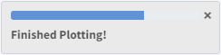
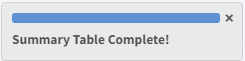

 

```{r models-setup, include = FALSE}
library(kableExtra)

def.chunk.hook  <- knitr::knit_hooks$get("chunk")
knitr::knit_hooks$set(chunk = function(x, options) {
  x <- def.chunk.hook(x, options)
  ifelse(options$size != "normalsize", paste0("\n \\", options$size,"\n\n", x, "\n\n \\normalsize"), x)
})
```

&nbsp;

# Introduction {-}

Welcome to the Shiny Model Explorer (Shimmer) user guide. This documentation serves as a step-by-step navigation guide for the shiny application and outlines the basic functionality available for modeling and simulation projects.

This user guide is not intended to be a comprehensive reference of the modeling techniques used in this application and assumes the user has experience in model building and interpretation.

The modeling in this application is based on an implementation of the <font color="darkred">**`mrgsolve`**</font> package. Prior experience with the <font color="darkred">**`mrgsolve`**</font> package is assumed for this shiny application. 

Whenever a reference is made from a source package or function, source documentation can be found at the bottom of the section. The main reference source can be found here: https://mrgsolve.org/user_guide/.

### Resources {-}

- Main resource page: https://mrgsolve.github.io
- Vignettes: https://mrgsolve.github.io/vignettes
- R documentation: https://mrgsolve.github.io/docs
- Gallery: https://github.com/mrgsolve/gallery

&nbsp;

# Dashboard {#dash}
In the current version, **Dashboard** is a landing page and does not contain any functionality. We intend to enhance the dashboard in a later version with more features, such as analytics and user-specific information.

&nbsp;

# Simulation Steps {#simsteps}
 


Upon launching the application, **Simulation Steps** appear at the top left corner. This is an interface displaying the necessary actions that need to be performed in order to produce simulation results. Action items in this list will be removed as they are performed by the user.

&nbsp;

# Model Selection {#modselect}
<blockquote class="style1">
**Step 1/4 of Simulation Steps**
</blockquote>


This application comes with a model library to select from, which can be found as indexed in `r text_spec("Select from Model Library", background = "#337AFF", color = "white", bold = T)`. 

Model Selection also allows users to `r text_spec("Upload Custom Model File", background = "#337AFF", color = "white", bold = T)` for user-defined model specifications that may not be in the model library.

&nbsp;


## Select from Model Library {#modlib}

The model library includes a collection of standard pharmacokinetic (PK) models for biologics:

&nbsp;

### Model Library Abbreviations
- **popPK**: population pharmacokinetic model
- **cmt**: compartment
- **mm**: Michaelis-Menten
- **iv**: intravenous injection
- **sc**: subcutaneous injection
- **tmdd**: target mediated drug disposition
- **abs**: absorption compartment
- **const**: constant
- **qe**: quasi-equilibrium
- **qss**: quasi-steady state


### Population PK Models
- **popPK_1cmt_mm_iv-sc**: 1 compartment PK with Michaelis-Menten elimination & IV/SC dosing
- **popPK_1cmt_linear_iv-sc**: 1 compartment PK with linear elimination & IV/SC dosing
- **popPK_1cmt_linear-mm_iv-sc**: 1 compartment PK with Michaelis-Menten/linear elimination & IV/SC dosing
- **popPK_2cmt_mm_iv-sc**: 2 compartment PK with Michaelis-Menten elimination & IV/SC dosing
- **popPK_2cmt_linear_iv-sc**: 2 compartment PK with linear elimination & IV/SC dosing
- **popPK_2cmt_linear-mm_iv-sc**: 2 compartment PK with Michaelis-Menten/linear elimination & IV/SC dosing
- **popPK_3cmt_linear_iv-sc**: 3 compartment PK with linear elimination & IV/SC dosing


### Target-Mediated Drug Disposition Models
- **tmdd_full_2cmt_1abs**: 2 compartment full TMDD model
- **tmdd_mm_2cmt_1abs**: 2 compartment TMDD model under Michaelis-Menten approximation
- **tmdd_mm-const_2cmt_1abs**: 2 compartment TMDD model under Michaelis-Menten approximation with constant concentration of target
- **tmdd_qe_2cmt_1abs**: 2 compartment TMDD model under quasi-equilibrium approximation
- **tmdd_qe-const_2cmt_1abs**: 2 compartment TMDD model under quasi-equilibrium approximation with constant concentration of target
- **tmdd_qss_2cmt_1abs**: 2 compartment TMDD model under quasi-steady state approximation
- **tmdd_qss-const_2cmt_1abs**: 2 compartment TMDD model under quasi-steady state approximation with constant concentration of target


&nbsp;


## Upload Custom Model File {#custommod}
Users can upload a custom model-specification file `(.cpp)` that is compatible with this application.

A fully annotated example <font color="darkred">**`mrgsolve`**</font> model specification file from the model library is shown below:

```{r model_annotate1, eval=FALSE}
Currently loaded model: popPK_1cmt_linear_iv-sc


$PARAM @annotated
TVCL   : 1.0000 : Clearance (L/day)
TVV2   : 25.000 : Central volume of distribution (L)
TVKA   : 0.5000 : Absorption rate constant (1/day)
TVF1   : 0.6100 : Bioavailability (unitless)
DOSE   : 0      : Dose amount (mg)
REGNUM : 0      : Dose regimen numeric ID (unitless)
WT     : 70.0   : Baseline subject body weight (kg)
WTREF  : 70.0   : Reference body weight (kg)
WTCL   : 0.75   : Power law exponent for body weight on CL (unitless)
WTV2   : 1.00   : Power law exponent for body weight on V2 (unitless)


$CMT @annotated
ABS    : SC dose absorption compartment (mg)
CENT   : Central compartment (mg)


$OMEGA @annotated
ETA_CL   : 0.1000 : IIV on CL (L/day)
ETA_V2   : 0.1000 : IIV on V2 (L)
ETA_KA   : 0.0100 : IIV on KA (1/day)
ETA_F1   : 0.0100 : IIV on F1 (unitless)


$SIGMA @annotated
PROP : 0.0001 : Proportional residual error (unitless)
ADD  : 0.1000 : Additive residual error (mg/L)


$MAIN
double CL = TVCL * exp(ETA_CL) * pow(WT/WTREF, WTCL);
double V2 = TVV2 * exp(ETA_V2) * pow(WT/WTREF, WTV2);
double KA = TVKA * exp(ETA_KA);
double F1 = (exp(TVF1 + ETA_F1) / (1 + exp(TVF1 + ETA_F1)));

F_ABS = F1;

double S2 = V2;  // Scaling factor for central volume:  dose = mg; conc = mg/L


$ODE
dxdt_ABS    = -KA*ABS;
dxdt_CENT   =  KA*ABS - (CL/V2)*CENT;


$TABLE
double IPRED = (CENT/S2);
double CP = IPRED;
double DV = IPRED*(1+PROP)+ADD;


// resimulate residual error (SIGMA) parameters if concentration is negative 
int i = 1;
while(DV < 0 & i <= 100) {
	simeps(1);
	simeps(2);
	DV = IPRED * (1 + PROP) + ADD;
	i++;
}

if(i > 100) mrg::report("Positive concentrations could not be obtained.");


$CAPTURE @annotated
DOSE   : Dose amount (mg)
REGNUM : Dose regimen numeric ID (unitless)
WT     : Baseline subject body weight (kg)
WTREF  : Reference body weight (kg)
DV     : Plasma concentration (mg/L)
IPRED  : Individual predicted plasma concentration (mg/L)
```

---

| [mrgsolve: Model Specification](https://mrgsolve.org/user_guide/model-specification.html#model-specification "mrgsolve: Chapter 2 Model specification")
| [mrgsolve: Code blocks](https://mrgsolve.org/user_guide/model-specification.html#code-blocks "mrgsolve: Chapter 2 Model Specification")
| [mrgsolve: Examples](https://mrgsolve.org/user_guide/model-specification.html#examples "mrgsolve: Chapter 2.6 Examples")
| [mrgsolve: Annotated model specification](https://mrgsolve.org/user_guide/topics.html#topic-annotated "mrgsolve: Chapter 10 Topics")

---

&nbsp;


## Load Model
After selecting a model from the library or uploading a custom model, execute `r text_spec("Load Model ", background = "#337AFF", color = "white", bold = T)`.

If the model file is properly formatted, the name of the model should appear under **Currently loaded model** and the contents of the model file should appear under **Model Specification file**.

If an invalid model specification file is uploaded, users will be notified with an error message stating: ("<font color="red">*_Invalid model specification file! Please select a different model..._*</font>")


&nbsp;


&nbsp;

## Model Parameters


### Fixed Effects {#fe}
`r text_spec("Fixed Effects", background = "#337AFF", color = "white", bold = T)` provides a pop-up window that allows users to specify values for parameters defined in the `$PARAM` code block of the model file.

An example of how fixed effects are linked to the model specification file is shown below.

&nbsp;

<!--colors 238, 205, 149  -->

&nbsp;


&nbsp;


### Random Effects 
`r text_spec("Random Effects", background = "#337AFF", color = "white", bold = T)` provides a pop-up window with variability options that allows the user to simulate variates using three options:

- Skip random effects using: <font color="green">**``None``**</font>
- Simulate between-subject random effects (one draw per individual) using: <font color="green">**`Interindividual Variability`**</font>
- Simulate within-subject random effects (one draw per observation) using: <font color="green">**`Residual Variability`**</font>
- Simulate using between and within subject random effects using: <font color="green">**`Both`**</font>


These random effect matrices are presented in correlation matrix form where:

- Diagonal elements: variances
- Off-diagonal elements: correlations. Valid off-diagonal elements must be in the range: `[-1, 1]`.

&nbsp;


The `r text_spec("Check Matrices", background = "#337AFF", color = "white", bold = T)` function initiates matrix validation tests which check for the following:

1. Square matrix
2. Symmetric matrix
3. Pass matrix into <font color="darkred">**`mrgsolve::mvgauss()`**</font> and verify valid results (invalid matrices produce `NaN` results)


---

| [mrgsolve::mvgauss()](https://mrgsolve.org/docs/reference/mvgauss.html "Simulate from a multivariate normal distribution with mean zero")

---


Transient pop-up messages will appear stating the results of the validation check for each variability option in the form of:


---

| [mrgsolve: Random effect variances](https://mrgsolve.org/user_guide/model-components.html#random-effect-variances "mrgsolve: Chapter 1.6 Random effect variances")

---

&nbsp;

# Simulation Details {#simdet}
This section allows users to `r text_spec("Submit Dosing Regimen", background = "#337AFF", color = "white", bold = T)` and provides **Simulation Options** such as `r text_spec("Time Grid", background = "#337AFF", color = "white", bold = T)`, `r text_spec("Simulation Settings", background = "#337AFF", color = "white", bold = T)`, and `r text_spec("Solver Settings", background = "#337AFF", color = "white", bold = T)` that can be combined with the model to create complex sampling designs.

Each of these are discussed below.

&nbsp;


## Define Dosing Regimen
Dosing regimen submission creates an <font color="darkred">*`Rx event object`*</font> that defines the dosing interventions for a single subject in the current model.


**Define Dosing Regimen** is an text input field that allows full customization of user-defined dosing regimens in a given simulation. By default, there is a placeholder Rx label specification in the text field to illustrate proper Rx label syntax required by <font color="darkred">**`mrgsolve::ev_rx`**</font> for complex, mutli-period dosing regimens.


The [Rx Label Syntax Documentation](https://mrgsolve.org/docs/reference/ev_rx.html "mrgsolve: Create intervention objects from Rx input") button, located below the **Define Dosing Regimen** text input box, opens reference documentation for the <font color="darkred">**`mrgsolve::ev_rx`**</font> function in a pop-up window. The rendered documentation outlines the syntax rules for defining a dosing regimen and includes some helpful examples. The Rx Label syntax rules are defined below:


&nbsp;

### Rx Label Syntax

- The <font color="green">**`dose`**</font> is found at the start of the string by sequential digits; this may be integer, decimal, or in scientific notation.

- Use <font color="green">**`in`**</font> to identify the dosing compartment number; must be integer.

- Use <font color="green">**`q`**</font> to identify the dosing interval; must be integer or decimal number (but not scientific notation).

- Use <font color="green">**`over`**</font> to indicate an infusion and its duration; integer or decimal number.

- Use <font color="green">**`x`**</font> to indicate total number of doses; must be integer.

- Use <font color="green">**`then`**</font> or <font color="green">**`,`**</font> to separate dosing periods.

- User <font color="green">**`after`**</font> to insert a lag in the start of a period; integer or decimal number (but not scientific notation).

&nbsp;

Provided is an example of a three event dosing regimen using the mrgsolve <font color="darkred">**`mrgsolve::ev_rx`**</font> function.

```{r syntax_example, eval=FALSE}
ev_rx("150 mg over 0.25 in 2, 
      100 mg in 1 over 0.25 q14 x 6 after 28, 
      100 mg over 0.25 in 2 q7 x 8 after 0.5")

Events:
   time amt rate ii addl cmt evid
1   0.0 150  600  0    0   2    1
2  28.0 100  400 14    5   1    1
3 112.5 100  400  7    7   2    1
```

---

| [mrgsolve: Event objects](https://mrgsolve.org/user_guide/event-chapter.html#event-chapter "mrgsolve: Chapter 4 Event objects")
| [mrgsolve: ev_rx](https://mrgsolve.org/user_guide/event-chapter.html#ev_rx "mrgsolve: Chapter 4.7.2 ev_rx")

---

&nbsp;

## Submit Dosing Regimen
<blockquote class="style1">
**Step 2/4 of Simulation Steps**
</blockquote>


After specifying the dosing regimen, `r text_spec("Submit Dosing Regimen", background = "#337AFF", color = "white", bold = T)` submits the regimen and creates an **Rx Dosing Event Dataset** as an input to the simulation. The variables included in the dosing event dataset are fixed and the values are dynamically populated according to the specified regimen.


Multiple dosing regimens can be and are submitted sequentially. Each regimen is labeled through unique identifier columns `REGNUM` and `REGLAB`. The dosing regimens that have `Include` selected will only be considered for downstream analysis. An example of submitting the default placeholder regimen segmented into three different regimens is shown below.


After submitting all desired regimens, they can be visualized through the **Rx Dosing Profile** plot, which depicts the concentration-time profile of a typical subject (no random effects applied) in the predefined dosing regimen, as shown below.


&nbsp;


If there is an error in syntax upon submission, **Define Dosing Regimen** will return ("<font color="red">*_Invalid Rx specification! Please follow Rx syntax rules_*...</font>").

&nbsp;


The Rx Dosing Event Dataset can be downloaded as a `(.csv)` file.


---

| [mrgsolve: Event data sets](https://mrgsolve.org/user_guide/data-set-chapter.html#data-set "mrgsolve: Chapter 3.2 Event data sets (data)")

---

&nbsp;

## Simulation Options


### Time Grid
The attributes of the simulation `r text_spec("Time Grid", background = "#337AFF", color = "white", bold = T)` can be combined with the specified model to create complex sampling designs. The time attributes of the simulation will affect all outputs including the simulation input dataset, simulation output dataset, summary statistic, graph, and report, and are described below:

- <font color="green ">**`start`**</font>: a number indicating start time for the simulation of the PK model.

- <font color="green">**`end`**</font>: a number indicating end time for the simulation of the PK model. By default, the **`end`** parameter is set to the calculated simulation end time. Selecting `modify end` allows a custom value for **`end`**.

- <font color="green">**`delta`**</font>: a number indicating the simulation time step, which is the duration between subsequent time points in the simulation.

- <font color="green">**`add`**</font>: is any arbitrary vector of additional times to simulate.

- <font color="green">**`offset`**</font>: a number that shifts all resulting <font color="darkred">`tgrid`</font> time points by a fixed amount.

- <font color="green">**`scale`**</font>: a number that scales all other <font color="darkred">`tgrid`</font> input parameters multiplicatively.


---

| [mrgsolve: Simulation time grid](https://mrgsolve.org/user_guide/model-components.html#component-stime "mrgsolve: Chapter 1.3 Simulation time grid")
| [mrgsolve: Time grid objects](https://mrgsolve.org/user_guide/topics.html#topic-tgrid "mrgsolve: Chapter 10.4 Time grid objects")

---

&nbsp;

### Simulation Settings {#simsettings}
The `r text_spec("Simulation Settings", background = "#337AFF", color = "white", bold = T)` option allows a user to apply the dosing event dataset to a population of subjects, choose the number of simulation iterations, and specify the random seed at which to perform simulations.

- <font color="green">**`Specify number of subjects`**</font>: Sets the number of subjects to simulate under the defined dosing regimen.

- <font color="green">**`Specify number of simulation iterations`**</font>: Sets the number of simulation iterations to run.

- <font color="green">**`Specify random seed`**</font>: A random seed is a starting point for generating random numbers and is useful for creating simulations that can be reproduced. The default seed is `2674474`. Although the seed is specified once, each simulation iteration will force the seed to change so that the random effect parameters are modeled appropriately.

&nbsp;


### Solver Settings
The `r text_spec("Solver Settings", background = "#337AFF", color = "white", bold = T)` described below are stored in the model object and passed to the solver when the simulation is started.

- <font color="green">**`atol`**</font>: Absolute tolerance parameter for local error estimate. Adjust this value lower when you see state variables (compartments) that are becoming very small and possibly turning negative.

- <font color="green">**`rtol`**</font>: Relative tolerance parameter for local error estimate. Adjust this value lower when you want more precision around the calculation of state variables as the system advances.

- <font color="green">**`ss_rtol`**</font>: Steady state absolute tolerance parameter to control the local error estimate when mrgsolve is finding steady state.

- <font color="green">**`ss_atol`**</font>: Steady state relative tolerance parameter to control the local error estimate when mrgsolve is finding steady state.
  
- <font color="green">**`maxsteps`**</font>: This is the maximum number of steps the solver will take when advancing 
from one time to the next.

- <font color="green">**`hmax`**</font>: The maximum step size. By default, the solver will take steps of 
different sizes based on what is happening in the simulation. So in a model where time is in hours, reducing hmax to `0.1` will prevent the solver from taking a step larger than `0.1` hours as it tries to advance to the next time.

- <font color="green">**`hmin`**</font>: The minimum step size. Only set this if you’re familiar with this setting.

- <font color="green">**`ixpr`**</font>: A flag to enable printing messages to the R console when the 
solver switches between non-stiff and stiff solving modes. Rarely used.

- <font color="green">**`mxhnil`**</font>: The maximum number of messages printed when the model is solving. 
If you have a lot of messages, keep working on your model code.

---

| [mrgsolve: Solver settings](https://mrgsolve.org/user_guide/model-components.html#solver-settings "mrgsolve: Chapter 1.4 Solver settings")
| [mrgsolve: Steady state](https://mrgsolve.org/user_guide/steady-state.html#steady-state "mrgsolve: Chapter 7 Steady state")

---

&nbsp;

### Expand Rx Dataset
<blockquote class="style1">
**Step 3/4 of Simulation Steps**
</blockquote>


In order to generate a standardized input dataset for simulation, which contains all default or user-defined **Dosing Regimens** and **Simulation Options**, the dataset needs to be "expanded".

**_For example_**:
After specifying the setting: <font color="green">**`Specify number of subjects`**</font> in [4.3.2 Simulation Settings](#simsettings), the same dosing regimen <font color="darkred">*`Rx event object`*</font> can be "expanded" for multiple individuals to create a population dataset.

The `r text_spec("Expand Rx Dataset", background = "#337AFF", color = "white", bold = T)` button combines all simulation input parameters to generate and display the expanded dataset in the **Simulation Input Dataset** section at the bottom of the page.


After the initial execution of `r text_spec("Expand Rx Dataset", background = "#337AFF", color = "white", bold = T)`, modifying simulation input parameters on the "Model Selection" or "Simulation Options" tabs will require the user to re-expand the input dataset prior to simulation.


&nbsp;


Transient pop-up messages will appear stating the steps of the dataset expansion in the form of:


&nbsp;


The Simulation Input dataset can be downloaded as a `(.csv)` file.

 


---

| [mrgsolve: Event Objects](https://mrgsolve.org/user_guide/event-chapter.html#event-chapter "mrgsolve: Chapter 4 Event Objects")

---

&nbsp;

# Simulation Output

This part of the application has options for customizing the simulation outputs and a preview pane that renders the outputs of the simulation after being processed. What is rendered here will be exported to the report.

&nbsp;

## User Settings & Output Metrics

### Plotting Options

 

#### Aesthetic
**Text Size**: Controls the text size of the legend and description.

**Transparency**: Controls the transparency of the data points of user added data (see section 5.1.1.3)

#### Model Options
**Show Prediction Interval**: Enables the prediction interval to display on plot (if random effects are added). No variability can be selected. This selection is displayed in the plot description.

**Concentration Units**: Selection to display the concentration/units on the y-axis.

**Select Plot DV**: Selection for which dependent variable is to be plotted on y-axis. Note that the annotation of this selection is added to the plot description and is taken from the `$CAPTURE @annotated` block of the model specification file.


#### Add user data (optional)
This application allows users to visually compare the simulation results to an external dataset.

Column headers should minimally include the following columns: `ID`, `CONCENTRATION`, `TIME`. A `DOSE` column can be added to stratify the data.

##### User Data Options
These options only become available is there is an uploaded dataset by the user.

**Select Plot DV User**: Choose the desired DV, which should be the same as the DV selected in the simulation model options. 

**Facet Variable**: Allows users to stratify the plots by this selection. An example is shown in section 5.3.


## Start Simulation

<blockquote class="style1">
**Step 4/4 of Simulation Steps**
</blockquote>

In order to process the **Simulation Input Dataset** and display simulation results, the `r text_spec("Start simulation", background = "#337AFF", color = "white", bold = T)` button should be used.


&nbsp;

Transient pop-up messages will appear stating the steps of the simulation in the form of:







&nbsp;

## Pharmacokinetic profiles
**Pharmacokinetic profile** plots are rendered with the selected dependent variable on the `y-axis` and **`Time after dose (days)`** on the `x-axis`. 

Note that there are buttons for `Linear`, `Log`, and `Both` to display accordingly in the Pharmacokinetic Profile Plots section.

&nbsp;

A rendering of the simulation output is displayed below.


A rendering of the simulation output as well as the added user data is displayed below.


&nbsp;

**Plotting Options** can be changed after the simulation is processed but will only render visually to the profiles pane if `r text_spec("Start simulation", background = "#337AFF", color = "white", bold = T)` is executed again.

&nbsp;


 

The **simulated dataset** can be downloaded as a `(.csv)` file. This dataset is different from the **Simulation Input Dataset** previously generated because it contains a unique identifier column (`REPI`) representing the <font color="green">**`Specify number of simulation iterations`**</font> setting discussed in [Section 4.3.2. Simulation Settings](#simsettings) as well as the results for each simulation iteration.

&nbsp;


## Summary statistics
 **Summary statistics** provide output metrics of the simulation and are calculated as follows:

&nbsp;

PK metrics (Cmax, Tmax, & AUC) are calculated for each subject, and the median value is summarized across subjects within each simulation iteration and dosing regimen. Finally, PK metric summary statistics (median, mean, & standard deviation) are calculated by dosing regimen across the simulation iterations.

**Cmax**: The maximum concentration of simulated drug


**Tmax**: The time at which the maximum concentration of drug is achieved

**Tlast**: The maximum time in the interval

**AUC**: The Area Under the Curve is calculated following the trapezoid rule from <font color="darkred">**`flux::auc()`**</font>

Users have the ability to control the time at which PK metrics are calculated by using the **Interval** slider.

---

| [flux::auc()](https://search.r-project.org/CRAN/refmans/flux/html/auc.html "Calculate the area under a line(curve).")

---
 


&nbsp;


# Report Generation
**Reporting information** requests information that is captured in the final output. This is meant to formalize and track simulation runs.

&nbsp;


&nbsp;


 

The `r text_spec("Generate Report", background = "#337AFF", color = "white", bold = T)` function exports the simulated run as a `(.pdf)` file with the naming convention: `popPK-simulation-report_(date)`. By default, this will render a `DRAFT` watermark on each page of the report unless **`Final Version`** is selected.

&nbsp;

## Final Report
The final report captures information from the simulation including (in order):

- Reporting information
- Model used
- Description
- Graphical outputs
- Summary Statistics
- Model names (definitions)
- Model details
- Model parameters
- Omega and Sigma matrices (correlation form)
- Initial conditions
- Output variables
- Simulation settings
- Solver settings
- Time grid settings
- Simulation time points
- Rx dosing specification
- Rx dosing specification
- Rx dosing dataset

&nbsp;


Below is an exmaple of a report that was generated from a sample run.

&nbsp;


&nbsp;

# General Information
This section provides information that may be helpful.

&nbsp;

# References {#ref}

These references are in order of when they appear in the document.

- [mrgsolve: Model Specification](https://mrgsolve.org/user_guide/model-specification.html#model-specification "mrgsolve: Chapter 2 Model specification")
- [mrgsolve: Code blocks](https://mrgsolve.org/user_guide/model-specification.html#code-blocks "mrgsolve: Chapter 2 Model Specification")
- [mrgsolve: Examples](https://mrgsolve.org/user_guide/model-specification.html#examples "mrgsolve: Chapter 2.6 Examples")
- [mrgsolve: Annotated model specification](https://mrgsolve.org/user_guide/topics.html#topic-annotated "mrgsolve: Chapter 10 Topics")
- [mrgsolve::mvgauss()](https://mrgsolve.org/docs/reference/mvgauss.html "Simulate from a multivariate normal distribution with mean zero")
- [mrgsolve: Random effect variances](https://mrgsolve.org/user_guide/model-components.html#random-effect-variances "mrgsolve: Chapter 1.6 Random effect variances")
- [mrgsolve: Event objects](https://mrgsolve.org/user_guide/event-chapter.html#event-chapter "mrgsolve: Chapter 4 Event objects")
- [mrgsolve: ev_rx](https://mrgsolve.org/user_guide/event-chapter.html#ev_rx "mrgsolve: Chapter 4.7.2 ev_rx")
- [mrgsolve: Event data sets](https://mrgsolve.org/user_guide/data-set-chapter.html#data-set "mrgsolve: Chapter 3.2 Event data sets (data)")
- [mrgsolve: Simulation time grid](https://mrgsolve.org/user_guide/model-components.html#component-stime "mrgsolve: Chapter 1.3 Simulation time grid")
- [mrgsolve: Time grid objects](https://mrgsolve.org/user_guide/topics.html#topic-tgrid "mrgsolve: Chapter 10.4 Time grid objects")
- [mrgsolve: Solver settings](https://mrgsolve.org/user_guide/model-components.html#solver-settings "mrgsolve: Chapter 1.4 Solver settings")
- [mrgsolve: Steady state](https://mrgsolve.org/user_guide/steady-state.html#steady-state "mrgsolve: Chapter 7 Steady state")
- [flux::auc()](https://search.r-project.org/CRAN/refmans/flux/html/auc.html "Calculate the area under a line(curve).")

&nbsp;

# Session Information
This documentation was created in R Studio with the following packages

&nbsp;

```{r sessioninfo, echo=FALSE}
cat(readLines("../../www/session_information.txt"), sep = "\n")
```

